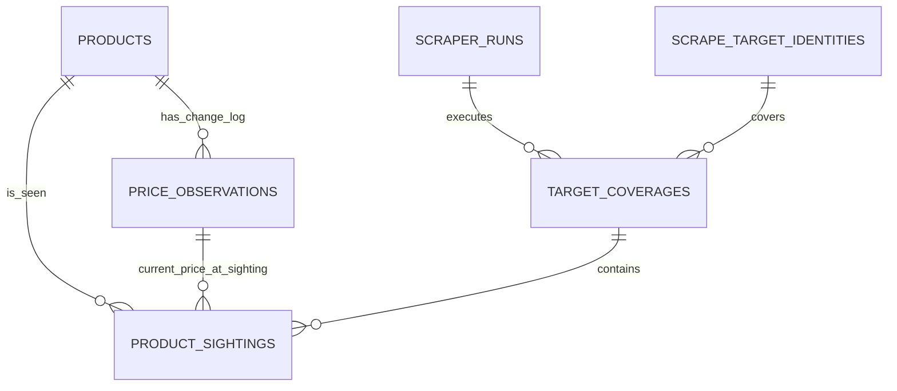

# P-001 Decision Record — Minimal Price History and Sightings

- Status: Accepted for implementation planning
- Date: 2026-07-18
- Phase: `P-001`
- Scope: investigation/design only
- Decision owner: orchestrator after review

## Decision Summary

1. Preserve `price_observations` as the only persisted price vector/change-log.
2. Add lightweight `product_sightings`; every sighting references the `price_observation` that was current for that product inside the same snapshot transaction.
3. Do not persist a second price-change/drop event table. Derive effective price, previous effective price, strict drop and strict historical-low using SQL views over `price_observations`.
4. Keep legacy `current_offers`/`deriveOffer` behavior during dual-read transition. Add a distinct real-price-drop reader/view; do not silently reinterpret the existing API.
5. Do not fabricate legacy sightings. Historical movements backfill completely from existing `price_observations`; current freshness becomes trustworthy only after the first post-cutover sighting.

## Evidence

### Verified

- `PriceInputSchema` requires at least one of regular/offer/card and accepts non-negative integer cents: `packages/contracts/src/schemas.ts:28-55`.
- `deriveOffer` computes public candidate as `offer ?? regular`, chooses strictly lower card price, gives ties to public, and returns `null` for regular-only rows: `packages/contracts/src/offers.ts:26-60`.
- `price_observations` stores product, timestamp, regular/offer/card, seller, stock and raw JSON; it has no run/target provenance: `packages/catalog/src/migrations/0001_init.sql:42-54`.
- `CatalogStore.samePrice` compares regular/offer/card, seller and stock; raw JSON does not trigger a price row. `maybeInsertPrice` reuses history by inserting only when that vector changes: `packages/catalog/src/write/catalog-store.ts:28-36,167-191`.
- Existing SQL already uses window functions for latest price and mirrors `deriveOffer`: `packages/catalog/src/migrations/0004_offer_search.sql:4-73`.
- Existing history is product-scoped, ordered by `(observed_at,id)`, ignores seller boundaries, and computes public/card lows independently: `packages/catalog/src/read/queries.ts:488-519`.
- Current DTOs expose promotional quality/discount and public/card lows, but not previous effective price, drop or overall effective historical low: `packages/contracts/src/offers.ts:214-273`.

### Inferred

- A regular-only observation must participate in temporal effective-price comparison even though it is not a legacy promotional offer; otherwise a later offer cannot be compared to its regular baseline.
- Seller-scoped partitioning would change the existing product-scoped history contract and require a separate seller identity model. The minimal compatible design remains product-scoped and exposes `seller_changed` metadata.
- Synthetic sightings cannot be backfilled truthfully because historical price rows do not identify their run, target or coverage.

### Unknown / Deferred

- Freshness TTL per target/capability belongs to later target/coverage design. The view exposes `last_sighted_at`; it does not hardcode TTL.
- Whether the public `/offers` route eventually changes from promotional snapshots to real drops is a consumer/API cutover decision. P-002 adds the new read contract without silently breaking the old one.

## Exact Price Semantics

### Effective price

For every price observation:

```text
public_candidate = offer_cents ?? regular_cents

if card_cents != null AND
   (public_candidate == null OR card_cents < public_candidate):
  effective_cents = card_cents
  price_access = "card"
else if public_candidate != null:
  effective_cents = public_candidate
  price_access = "public"
else:
  effective_cents = null
  price_access = null
```

Rules:

- Card ties prefer public, matching `deriveOffer`.
- Future validated rows always have an effective price because `PriceInputSchema` requires at least one price.
- A legacy/corrupt all-null row yields `effective_cents=null`; it never creates drop/low and remains visible only in raw history.
- Zero cents is valid under the current contract and participates normally. This decision does not add a stricter business validation.
- Temporal effective price is a new pure primitive (`deriveEffectivePrice` in implementation). Existing `deriveOffer` should reuse it but retain its current gate: regular-only is not a legacy promotional offer.

### Sequence and previous observation

- Comparison key: `product_id`.
- Total order: `observed_at ASC, id ASC`; `id` breaks timestamp ties deterministically.
- `previous_price_observation_id` is the immediately preceding row for the product, not the preceding sighting.
- If the immediate previous row has `effective_cents=null`, `previous_effective_cents=null` and the current row is not a drop. Historical minimum may still use earlier valid rows.

### Seller

- Seller changes do not reset the sequence; history remains product-scoped for compatibility.
- `seller_changed=true` when a previous row exists and `seller_id` differs using null-safe comparison.
- A lower effective price after a seller change is still a product-level drop because it is the newly available effective price for the same store product. Consumers can disclose/filter `seller_changed`; this decision does not claim a same-seller drop.
- `NULL` seller means unknown/store seller and is compared null-safely; it is not converted to a fabricated ID.

### Stock

- `effective_cents` is computed regardless of stock so raw history remains complete.
- `is_price_drop` and `is_historical_low` require the current row to be `in_stock=1`; an unavailable price is not a real current offer.
- Previous stock does not suppress comparison. A product returning in stock at a lower effective price can be a drop; `previous_in_stock` is exposed for explanation.
- Stock-only changes remain price observations because current `samePrice` includes stock. Equal effective cents means no drop/low.

### Real price drop

```text
is_price_drop =
  current.in_stock == 1 AND
  current.effective_cents != null AND
  previous.effective_cents != null AND
  current.effective_cents < previous.effective_cents
```

- Strict inequality only.
- First observation: false.
- Equal price: false, including public/card access-channel changes at the same effective price.
- Price increase: false.
- Card-driven reduction: true, with `price_access='card'` so conditional access is explicit.
- Regular-only reduction: true even though legacy `deriveOffer` would return null; temporal drop and promotional snapshot are intentionally different concepts.

### Strict historical low

```text
prior_historical_low_cents =
  MIN(effective_cents of all prior rows for product_id, ignoring nulls)

is_historical_low =
  current.in_stock == 1 AND
  current.effective_cents != null AND
  prior_historical_low_cents != null AND
  current.effective_cents < prior_historical_low_cents
```

- First valid observation: false; there is no prior baseline.
- Equal to a previous minimum: false.
- The prior minimum includes public/card and in/out-of-stock rows, preserving the complete product-level price history. Current must be in stock for the flag.
- Existing `publicHistoricalLowCents` and `cardHistoricalLowCents` remain available unchanged during transition. The new flag is the strict overall effective low.
- `is_historical_low` is independent from immediate drop. After a legacy all-null row, a current price may be a historical low but not a drop because the immediate previous effective is null.

## Minimal Logical Model



Cardinalities/invariants:

- Product 1:N price observations.
- Product 1:N sightings.
- Price observation 1:N sightings: repeated unchanged sightings reuse one price row.
- Run 1:N coverages; target identity 1:N coverages.
- Coverage 1:N sightings.
- Exactly one sighting per `(coverage_id, product_id)`.
- Every sighting references a price observation belonging to the same product.
- Run/target are derived through `coverage_id`; do not duplicate them on sightings.

### Proposed additive schema

Names of target/coverage tables may be finalized in P-002, but the sighting contract is fixed:

```sql
-- Required for a composite FK that proves the referenced price belongs to product.
CREATE UNIQUE INDEX uq_price_observations_id_product
  ON price_observations(id, product_id);

CREATE TABLE product_sightings (
  id                   INTEGER PRIMARY KEY AUTOINCREMENT,
  coverage_id          INTEGER NOT NULL REFERENCES target_coverages(id) ON DELETE CASCADE,
  product_id           INTEGER NOT NULL REFERENCES products(id) ON DELETE CASCADE,
  price_observation_id INTEGER NOT NULL,
  seen_at              TEXT NOT NULL,
  source_hash          TEXT,
  UNIQUE(coverage_id, product_id),
  FOREIGN KEY (price_observation_id, product_id)
    REFERENCES price_observations(id, product_id)
);

CREATE INDEX idx_product_sightings_product_latest
  ON product_sightings(product_id, seen_at DESC, id DESC);
CREATE INDEX idx_product_sightings_price
  ON product_sightings(price_observation_id);
```

`source_hash` is optional sighting evidence. Price values, seller, stock and raw JSON are not copied.

### Writer transaction contract

Within `CatalogStore.productSnapshot` transaction:

1. Upsert product/categories.
2. Select latest price observation by `(observed_at DESC,id DESC)`.
3. If `samePrice`, reuse latest `id`; otherwise insert price row with `RETURNING id`.
4. Insert one sighting using coverage/product/selected price ID.
5. Continue variants/images and commit atomically.

The writer result should expose `priceObservationId` and `priceInserted`; no caller recomputes the reference.

## View Decision: Views, Not Persisted Events

### Chosen

Create an all-history movement view and a current-drop view. Do not create `price_changes` or `price_drop_events` tables.

### Evidence and tradeoffs

| Option | Benefits | Costs/Risks | Decision |
| --- | --- | --- | --- |
| SQL window views | No duplicated prices/flags; deterministic from existing append-only log; full legacy history available immediately; mirrors current view pattern | Window cost; requires indexes and measured query plan | Chosen |
| Persisted drop event | Easy incremental delivery and direct index | Duplicates derived state; drift/backfill/idempotency/versioning problems; seller/stock rule changes require rewrite | Rejected until measured need |
| Compute only in TypeScript reader | No schema object | Repeated O(N) scans, inconsistent pagination/current filtering, SQL/TS semantic drift | Rejected as sole source |

A future persisted event requires measured query/streaming need, versioned derivation and reconciliation; none exists today.

## Executable SQL Contract

```sql
CREATE VIEW price_observation_movements AS
WITH candidates AS (
  SELECT po.*,
         COALESCE(po.offer_cents, po.regular_cents) AS public_candidate
  FROM price_observations po
), effective AS (
  SELECT c.*,
    CASE
      WHEN c.card_cents IS NOT NULL
       AND (c.public_candidate IS NULL OR c.card_cents < c.public_candidate)
      THEN c.card_cents
      ELSE c.public_candidate
    END AS effective_cents,
    CASE
      WHEN c.card_cents IS NOT NULL
       AND (c.public_candidate IS NULL OR c.card_cents < c.public_candidate)
      THEN 'card'
      WHEN c.public_candidate IS NOT NULL THEN 'public'
      ELSE NULL
    END AS price_access
  FROM candidates c
), sequenced AS (
  SELECT e.*,
    LAG(e.id) OVER w AS previous_price_observation_id,
    LAG(e.effective_cents) OVER w AS previous_effective_cents,
    LAG(e.price_access) OVER w AS previous_price_access,
    LAG(e.seller_id) OVER w AS previous_seller_id,
    LAG(e.in_stock) OVER w AS previous_in_stock,
    MIN(e.effective_cents) OVER (
      PARTITION BY e.product_id
      ORDER BY e.observed_at, e.id
      ROWS BETWEEN UNBOUNDED PRECEDING AND 1 PRECEDING
    ) AS prior_historical_low_cents
  FROM effective e
  WINDOW w AS (PARTITION BY e.product_id ORDER BY e.observed_at, e.id)
)
SELECT s.*,
  CASE WHEN s.in_stock = 1
         AND s.effective_cents IS NOT NULL
         AND s.previous_effective_cents IS NOT NULL
         AND s.effective_cents < s.previous_effective_cents
       THEN 1 ELSE 0 END AS is_price_drop,
  CASE WHEN s.in_stock = 1
         AND s.effective_cents IS NOT NULL
         AND s.prior_historical_low_cents IS NOT NULL
         AND s.effective_cents < s.prior_historical_low_cents
       THEN 1 ELSE 0 END AS is_historical_low,
  CASE WHEN s.previous_price_observation_id IS NOT NULL
         AND s.seller_id IS NOT s.previous_seller_id
       THEN 1 ELSE 0 END AS seller_changed
FROM sequenced s;
```

Latest sighting and current real drops:

```sql
CREATE VIEW latest_product_sightings AS
SELECT s.*
FROM (
  SELECT ps.*,
         ROW_NUMBER() OVER (
           PARTITION BY ps.product_id ORDER BY ps.seen_at DESC, ps.id DESC
         ) AS rn
  FROM product_sightings ps
) s
WHERE s.rn = 1;

CREATE VIEW current_price_drops AS
SELECT m.*, s.seen_at AS last_sighted_at, s.coverage_id
FROM (
  SELECT pom.*,
         ROW_NUMBER() OVER (
           PARTITION BY pom.product_id ORDER BY pom.observed_at DESC, pom.id DESC
         ) AS rn
  FROM price_observation_movements pom
) m
JOIN latest_product_sightings s
  ON s.product_id = m.product_id
 AND s.price_observation_id = m.id
WHERE m.rn = 1 AND m.is_price_drop = 1;
```

The reader applies target-specific freshness to `last_sighted_at`; the view does not embed policy TTL.

Recommended additive index to benchmark:

```sql
CREATE INDEX idx_price_observations_product_sequence
  ON price_observations(product_id, observed_at, id);
```

## Backfill, Cutover and Rollback

### Migration/backfill

1. Add new tables/indexes/views in a new migration; do not edit `0001`/`0004`.
2. Do not rewrite or duplicate existing `price_observations`.
3. Do not synthesize legacy sightings/coverage. Provenance is unknowable.
4. Movement view immediately derives the entire legacy sequence.
5. `current_price_drops` intentionally excludes products until a post-cutover sighting proves current price/freshness.

### Cutover

1. Deploy additive migration; old readers continue using `current_offers`.
2. Deploy writer returning/reusing `priceObservationId` and inserting sightings atomically.
3. Add contracts/readers for movement history and `current_price_drops`; validate SQL against a TS `deriveEffectivePrice` mirror.
4. Dual-read and compare latest price IDs/effective values.
5. Expose real-drop query separately (`searchPriceDrops` or equivalent). Do not silently change `searchOffers` semantics.
6. A later consumer/API decision may retire or rename promotional `current_offers` after all consumers migrate.

### Rollback

- Roll back application/read selection, not the additive migration.
- Old writer/readers ignore new tables/views and preserve price history.
- Disable real-drop reads while sightings are not being written; gaps are visible, not backfilled falsely.
- Re-enable the new writer and resume sightings; no change-log reconstruction required.
- Do not drop sightings/views during emergency rollback; destructive down migration adds risk without restoring data.

## Validation Queries

```sql
-- No sighting references another product's price row.
SELECT ps.id
FROM product_sightings ps
JOIN price_observations po ON po.id = ps.price_observation_id
WHERE po.product_id <> ps.product_id;

-- No duplicate product within one coverage.
SELECT coverage_id, product_id, COUNT(*) n
FROM product_sightings
GROUP BY coverage_id, product_id
HAVING n > 1;

-- All post-cutover sightings have a price reference.
SELECT COUNT(*) FROM product_sightings WHERE price_observation_id IS NULL;

-- Drop must always be strict and currently in stock.
SELECT id FROM price_observation_movements
WHERE is_price_drop = 1
  AND (in_stock <> 1 OR effective_cents >= previous_effective_cents);

-- Historical low must be strict against a prior baseline.
SELECT id FROM price_observation_movements
WHERE is_historical_low = 1
  AND (in_stock <> 1 OR prior_historical_low_cents IS NULL
       OR effective_cents >= prior_historical_low_cents);

-- Current drop must be backed by latest sighting of the same latest price row.
SELECT d.product_id
FROM current_price_drops d
LEFT JOIN latest_product_sightings s ON s.product_id = d.product_id
WHERE s.id IS NULL OR s.price_observation_id <> d.id;
```

Also compare SQL vs TypeScript for every row:

```text
SQL effective_cents/price_access == deriveEffectivePrice(row)
SQL legacy quality/discount == deriveOffer(row) where deriveOffer != null
```

## Test Matrix for P-002

| Case | Current effective/access | Previous | Drop | Historical low | Notes |
| --- | --- | --- | --- | --- | --- |
| First regular-only 100 | 100/public | null | false | false | Valid temporal baseline; not legacy promotional offer |
| Same snapshot again | no new price row | 100 | false | false | New sighting reuses price ID |
| Stock true→false, same 100 | 100/public | 100 | false | false | Price row inserted; no actionable offer |
| Out-of-stock 100→in-stock offer 90 | 90/public | 100 | true | true | Previous stock does not suppress |
| Offer 90→card 80 | 80/card | 90 | true | true | Conditional access explicit |
| Card 80→public 80 | 80/public | 80 | false | false | Tie/equal, access changed only |
| Seller A 80→Seller B 70 | 70/(derived) | 80 | true | true | Product-level; `seller_changed=true` |
| Seller changes, same 80 | 80 | 80 | false | false | Change-log row, no price movement |
| Rise 80→85 | 85 | 80 | false | false | No drop/low |
| Return to prior min 80 | 80 | 85 | true | false | Drop but not strict new low |
| New min 75 | 75 | 80 | true | true | Both flags |
| Legacy all-null | null/null | prior | false | false | Invalid future input, robust history |
| Valid 70 after all-null | 70 | null | false | depends on prior min; true if strict | Immediate previous governs drop |
| Current out-of-stock lower | lower | prior | false | false | Not actionable |
| Raw JSON-only change | no new price row | unchanged | false | false | New sighting/source hash only |
| Timestamp tie | per larger `id` | deterministic | strict rule | strict rule | Total ordering stable |

Required test levels:

- Unit: `deriveEffectivePrice`, null/card/tie semantics, drop/low helper parity.
- Catalog integration: insert/reuse price ID and sighting atomically; FK/unique constraints.
- Migration: clean DB, upgrade from current DB, idempotent migration runner.
- SQL contract: window view matrix above and query-plan benchmark with representative history.
- Reader contract: legacy `getOfferHistory`/`searchOffers` unchanged; additive movement/drop DTOs.
- Rollback: old writer/readers function against migrated DB; new reader disabled when sightings stop.

## Validation Performed in P-001

An in-memory Bun SQLite experiment created the proposed movement view and exercised:

- regular-only first baseline;
- stock-only change;
- public drop;
- card-driven drop;
- seller change at same price;
- price increase;
- legacy all-null row;
- valid price following all-null;
- card-only and card/public tie.

Observed results matched the contract:

- first row: drop=false, low=false;
- 100→90: drop=true, low=true;
- 90→card 80: drop=true, low=true;
- seller change at 80: seller_changed=true, drop=false, low=false;
- all-null: effective=null, both flags false;
- 70 after immediate all-null: drop=false, historical-low=true against earlier valid minimum;
- card/public tie selected public and did not create a drop.

The experiment used only an in-memory database; the working database was not opened or modified.

## Risks and Follow-up Decisions

- Window performance must be measured on representative history before adding more than the proposed sequence index. Do not materialize preemptively.
- Product-scoped seller comparison is deliberate compatibility. A future same-seller analytics requirement needs a separate explicit contract, not an implicit partition change.
- Existing promotional `current_offers` and real temporal drops are distinct during transition; naming must stay explicit.
- Freshness is sighting/coverage policy and remains for P-002/P-003.
- No consumer-specific event or Discord/recommendation contract belongs in this model.

## Recommended Orchestrator Action

Accept P-001 and delegate P-002 using this record as the binding data contract. Keep phase status unchanged until orchestrator verification.
